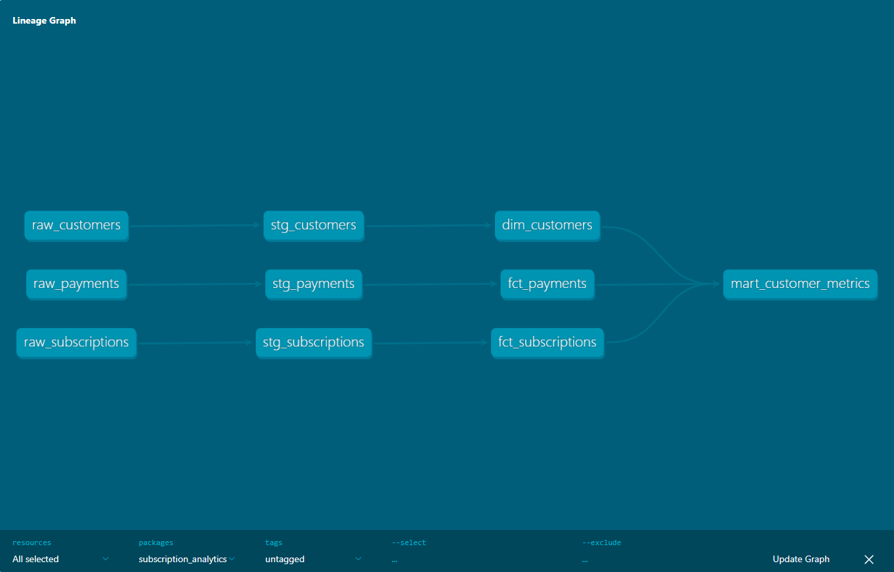
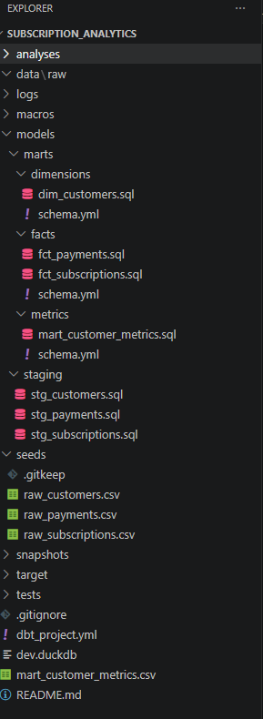
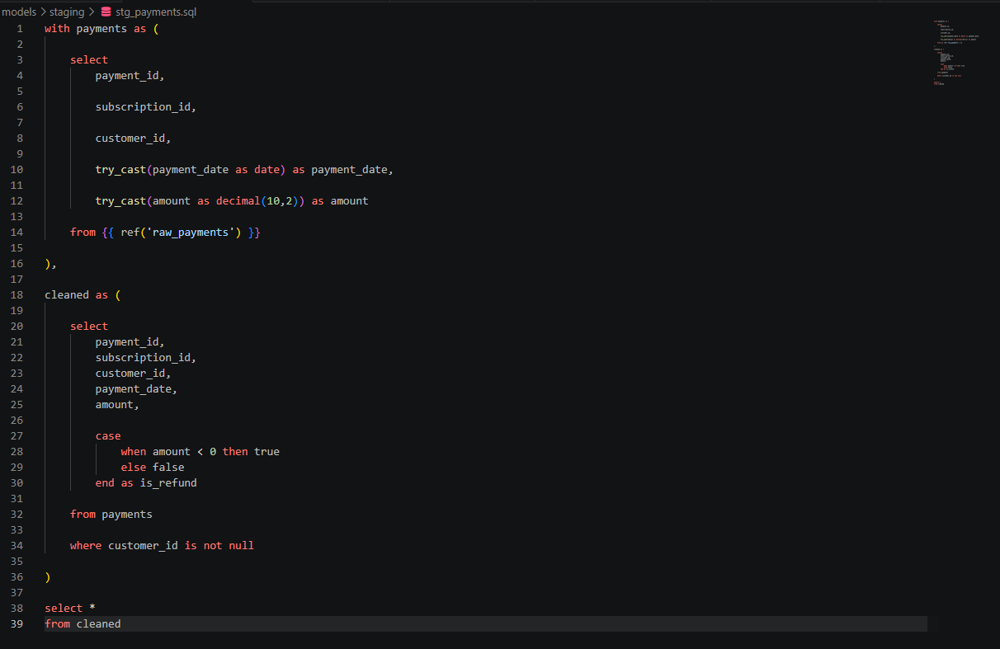
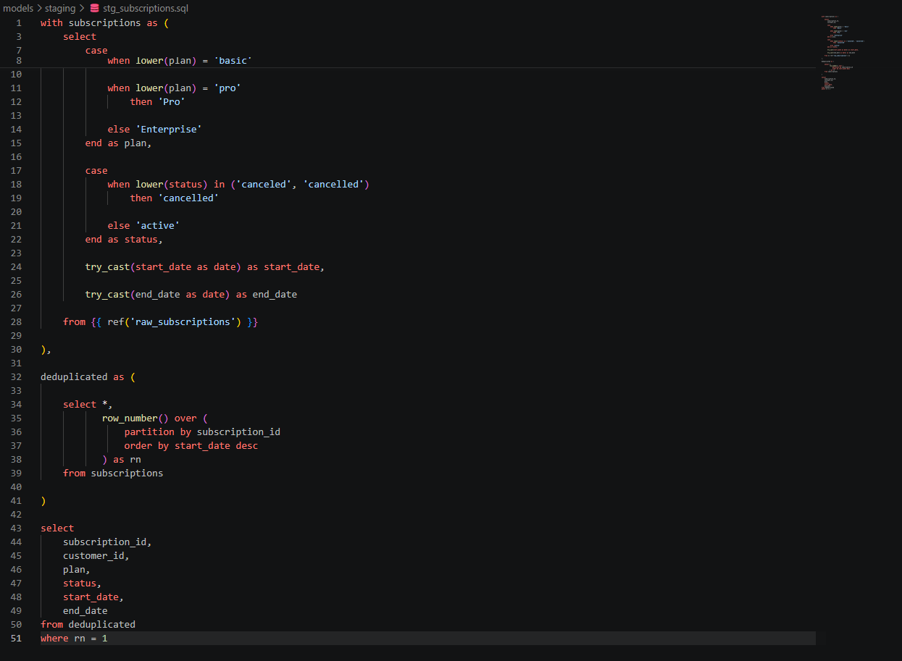
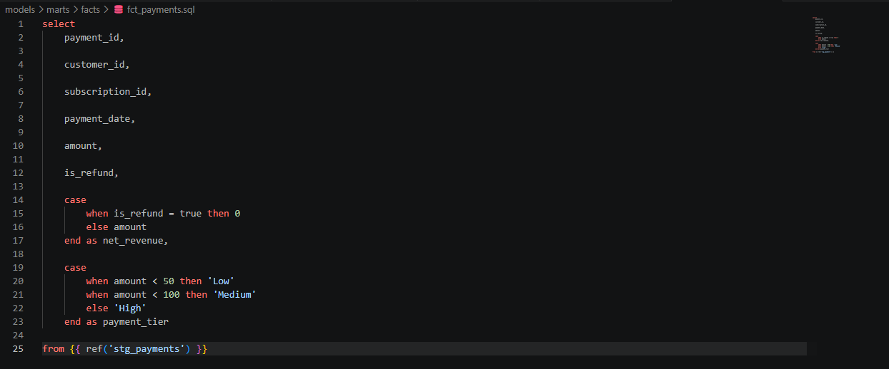
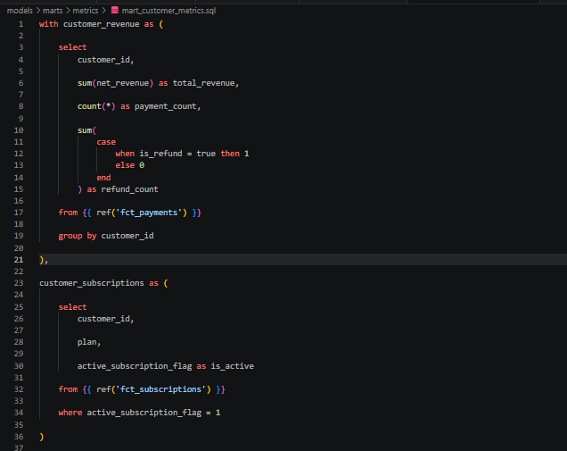
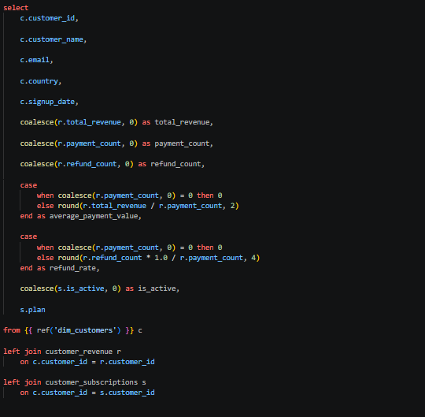
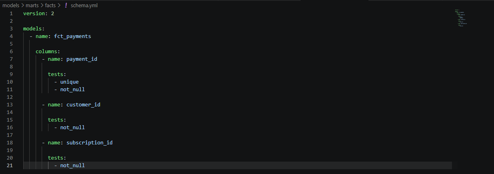

# Subscription Analytics Pipeline com dbt, DuckDB e SQL

## Visão Geral

Projeto de Analytics Engineering desenvolvido para transformar dados brutos de clientes, assinaturas e pagamentos em uma camada analítica confiável, documentada e pronta para consumo.

A solução foi construída utilizando **dbt**, **DuckDB** e **SQL**, seguindo uma arquitetura moderna baseada em camadas analíticas. O projeto contempla modelagem dimensional, testes automatizados de qualidade, documentação da linhagem dos dados e construção de métricas voltadas à análise de clientes, assinaturas e receita.

O projeto foi desenvolvido para simular um ambiente real de Analytics Engineering, aplicando práticas utilizadas em pipelines analíticas modernas para garantir confiabilidade, rastreabilidade e reutilização dos ativos de dados.

---

## Objetivo

Simular um cenário real de Analytics Engineering aplicando boas práticas de mercado para:

- Padronização e transformação de dados.
- Centralização de regras de negócio.
- Construção de modelos analíticos reutilizáveis.
- Garantia de qualidade dos dados.
- Disponibilização de métricas para análise de negócio.

---

## Stack

- SQL
- dbt
- DuckDB
- YAML
- Git
- GitHub

---


## Arquitetura da Solução

A pipeline foi estruturada utilizando uma arquitetura em camadas para separar responsabilidades entre preparação, modelagem e disponibilização dos dados.

```text
Raw Data
    ↓
Staging
    ↓
Facts & Dimensions
    ↓
Mart
```

### Camadas

| Camada | Responsabilidade |
|---------|---------|
| Raw Data | Armazenamento dos dados brutos |
| Staging | Limpeza, padronização e preparação dos dados |
| Facts & Dimensions | Aplicação das regras de negócio e modelagem dimensional |
| Mart | Consolidação das métricas finais |

### Lineage Graph

O dbt gera automaticamente a documentação da linhagem dos dados, permitindo rastrear todas as dependências entre modelos.



---

## Estrutura do Projeto

Organização do repositório seguindo boas práticas do dbt:



---

## Modelagem Analítica

### Staging

Responsável pela preparação dos dados brutos através de:

- Conversão de tipos
- Padronização de atributos
- Tratamento de inconsistências
- Remoção de registros inválidos
- Aplicação inicial de regras de negócio

#### Principais Modelos

##### stg_payments

- Conversão de datas e valores monetários
- Identificação de pagamentos reembolsados
- Criação do indicador `is_refund`
- Remoção de registros inválidos



##### stg_subscriptions

- Padronização de planos
- Padronização de status
- Tratamento de duplicidades
- Identificação da versão mais recente das assinaturas



---

### Dimensão de Clientes

Centraliza atributos cadastrais dos clientes:

- Customer ID
- Nome
- E-mail
- País
- Data de Cadastro

---

### Fato de Pagamentos

Consolida eventos financeiros utilizados na geração das métricas.

Principais atributos:

- Pagamentos
- Reembolsos
- Receita Líquida
- Faixa de Valor
- Data da Transação



---

### Fato de Assinaturas

Consolida informações relacionadas ao ciclo de vida das assinaturas.

Principais atributos:

- Plano Contratado
- Status da Assinatura
- Indicador de Assinatura Ativa

---

## Camada Mart

Camada final responsável pela consolidação das métricas de negócio.

Os dados brutos de clientes, assinaturas e pagamentos são transformados em um modelo analítico único, pronto para consumo por analistas, dashboards e áreas de negócio.

Principais cálculos:

- Receita por Cliente
- Quantidade de Pagamentos
- Quantidade de Reembolsos
- Ticket Médio
- Taxa de Reembolso
- Status da Assinatura
- Plano Ativo

### Modelo Analítico Final

A construção do modelo final foi realizada através de CTEs responsáveis por consolidar informações de clientes, pagamentos e assinaturas em uma única camada analítica.





### Estrutura da Camada Analítica

O modelo `mart_customer_metrics` representa o produto final da pipeline analítica.

Ele consolida informações provenientes das dimensões e tabelas fato, centralizando métricas de receita, pagamentos e assinaturas em um único dataset analítico pronto para consumo.

| Coluna | Descrição |
|---------|---------|
| customer_id | Identificador único do cliente |
| customer_name | Nome do cliente |
| email | E-mail do cliente |
| country | País do cliente |
| total_revenue | Receita total gerada pelo cliente |
| payment_count | Quantidade de pagamentos realizados |
| refund_count | Quantidade de reembolsos recebidos |
| plan | Plano de assinatura do cliente |

### Valor para o Negócio

A camada analítica final permite responder perguntas como:

- Quais clientes geram mais receita?
- Qual o volume de pagamentos por cliente?
- Qual a taxa de reembolso da operação?
- Quais planos possuem maior adesão?
- Como a receita está distribuída entre os clientes?
- Quais segmentos de clientes apresentam maior valor para o negócio?

Ao centralizar métricas e regras de negócio em um único modelo analítico, a solução reduz a necessidade de transformações adicionais, aumenta a consistência das análises e facilita a construção de dashboards e relatórios para tomada de decisão.

---

## Qualidade de Dados

A qualidade dos dados foi implementada utilizando os testes nativos do dbt.

### Testes Aplicados

#### not_null

Validação de campos obrigatórios:

- `customer_id`
- `payment_id`
- `subscription_id`

#### unique

Validação de unicidade:

- `customer_id`
- `payment_id`



Os testes são executados automaticamente pelo dbt durante a validação da pipeline, garantindo integridade e consistência dos principais identificadores utilizados ao longo da solução analítica.

---

## Resultados

- Pipeline analítica completa construída com dbt, DuckDB e SQL.
- Modelagem dimensional baseada em Facts e Dimensions.
- Consolidação de dados de clientes, assinaturas e pagamentos.
- Centralização das regras de negócio.
- Construção de métricas reutilizáveis para análise.
- Implementação de testes automatizados de qualidade.
- Documentação automática da linhagem dos dados.
- Estrutura preparada para evolução e manutenção.
- - Disponibilização de uma camada analítica pronta para consumo por dashboards, relatórios e análises ad hoc.