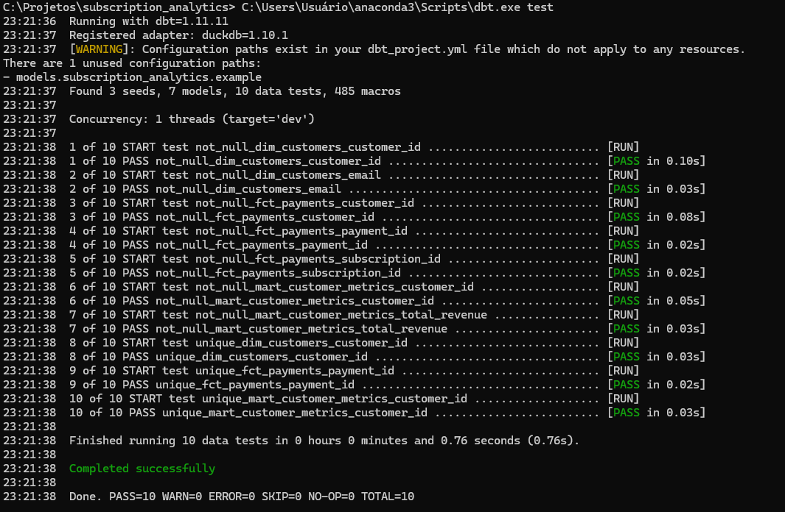
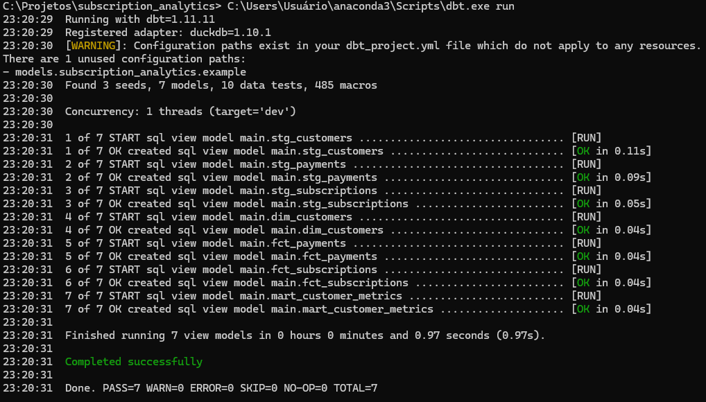

# Subscription Analytics Pipeline com dbt, DuckDB e SQL

## Visão Geral

Projeto de Analytics Engineering desenvolvido para transformar dados brutos de clientes, assinaturas e pagamentos em uma camada analítica confiável, documentada e pronta para consumo.

A solução foi construída utilizando dbt, DuckDB e SQL, seguindo uma arquitetura em camadas e incorporando testes automatizados, documentação da linhagem dos dados e modelagem analítica orientada a métricas de negócio.

## Arquitetura

A pipeline foi estruturada seguindo o fluxo:

**Raw Data → Staging → Facts & Dimensions → Mart**

O Lineage Graph permite visualizar a rastreabilidade completa das transformações e dependências entre os modelos.

## Principais Funcionalidades

- Padronização e tratamento de dados de clientes, assinaturas e pagamentos.
- Construção de modelos analíticos reutilizáveis.
- Implementação de regras de negócio em SQL.
- Modelagem em camadas seguindo boas práticas de Analytics Engineering.
- Testes automatizados de qualidade de dados com dbt.
- Documentação automática da linhagem dos dados.
- Geração de métricas prontas para consumo analítico.

## Estrutura do Projeto

Organização do projeto dbt contendo modelos, documentação, testes e componentes de transformação.

## Camada Staging

Responsável pela limpeza, padronização e preparação dos dados brutos para consumo analítico.

### Pagamentos

Modelo responsável pelo tratamento dos dados de pagamentos, incluindo padronização de tipos de dados, normalização de campos e identificação de reembolsos.

### Assinaturas

Modelo responsável pela padronização das informações de assinaturas, tratamento de status e preparação dos dados para consumo analítico.

## Modelagem Analítica

Construção de dimensões e fatos para suportar análises de clientes, pagamentos e assinaturas.

### Dimensão de Clientes

Modelo responsável pela consolidação das informações cadastrais dos clientes.

### Fato de Pagamentos

Tabela fato contendo eventos financeiros, pagamentos realizados, reembolsos e métricas derivadas.

### Fato de Assinaturas

Tabela fato contendo informações relacionadas às assinaturas, planos contratados e status dos clientes.

## Camada Mart

Camada final destinada ao consumo analítico.

### Construção das Métricas

Processo de agregação e cálculo dos principais indicadores de negócio.

### Modelo Final

Modelo analítico consolidado contendo métricas prontas para utilização em dashboards, relatórios e análises.

Indicadores gerados:

- Receita total
- Quantidade de pagamentos
- Quantidade de reembolsos
- Ticket médio
- Taxa de reembolso
- Status da assinatura
- Plano ativo

## Qualidade de Dados

Foram implementados testes automatizados utilizando dbt para garantir integridade, consistência e confiabilidade dos modelos analíticos.

Principais validações implementadas:

- not_null
- unique
- validação de relacionamentos
- consistência estrutural dos modelos

### Configuração dos Testes

Definição dos testes de qualidade através de arquivos YAML.

### Execução dos Testes

Execução automatizada dos testes de qualidade dos modelos.

## Execução da Pipeline

Materialização completa dos modelos através do dbt.

## Stack Utilizada

- SQL
- dbt
- DuckDB
- YAML
- Git
- GitHub
- Data Modeling
- Data Quality Testing

## Competências Demonstradas

- Analytics Engineering
- SQL Avançado
- Data Modeling
- Data Transformation
- Data Cleaning
- Data Quality
- dbt
- DuckDB
- Documentação de Dados
- Versionamento com Git
- Construção de Pipelines Analíticas

## Dataset

O projeto utiliza dados simulados de clientes, assinaturas e pagamentos para fins educacionais e demonstração técnica.

## Resultado

Foi construída uma pipeline analítica completa utilizando dbt e DuckDB, contemplando transformação de dados, modelagem analítica, testes automatizados e documentação da linhagem dos dados.

A solução entrega uma camada final de métricas pronta para consumo analítico, seguindo práticas modernas de Analytics Engineering, governança de dados e desenvolvimento orientado à qualidade.
